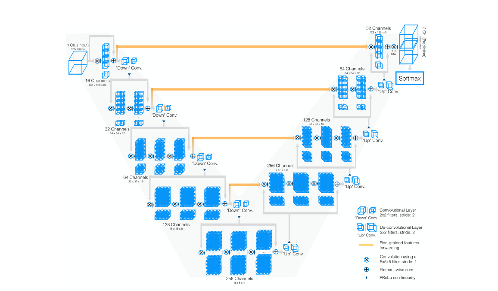
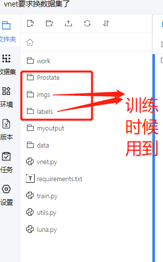

# AI-Studio-Vnet论文复现

## 项目描述
  
> Vnet模型，最近在计算机视觉和模式识别方面的研究突出了卷积神经网络(CNNs)的能力，以解决具有挑战性的任务，如分类、分割和目标检测。
> 实现了最先进的性能。这种成功归因于cnn学习原始输入数据的层次表示的能力，而不依赖手工制作的特征。当输入通过网络层进行处理时，
> 产生的特性的抽象级别就会增加。浅层掌握局部信息，而深层掌握局部信息。分割是医学图像分析中一个高度相关的任务。自动描绘感兴趣的器官
> 和结构通常是必要的，以执行任务，如视觉增强，计算机辅助诊断，干预和定量指标提取图像。
> 在这项工作中，我们的目标是分割肺实质 。这是一个具有挑战性的任务，因为在不同的扫描中，由于变形和强度分布的变化，肺实质可以呈现不同的外观
> 。此外，由于场的不均匀性， 还是在治疗计划中，解剖边界的估计需要准确

**论文：**

- [V-Net: Fully Convolutional Neural Networks for Volumetric Medical Image Segmentation](https://paperswithcode.com/paper/v-net-fully-convolutional-neural-networks-for)

**项目参考：**
- [https://github.com/mattmacy/vnet.pytorch](https://github.com/mattmacy/vnet.pytorch)


##快速开始
###第一步：克隆本项目
git clone https://github.com/YellowLight021/Vnet
cd Vnet

```
-imgs              #执行unzip脚本后会将原ct文件都放入该文件夹
-labels  #执行unzip脚本后会将原标注文件都放入该文件夹
-README.MD
-requirements      #模型训练时候需要pip install 的包。SimpleITK、scikit-image、setproctitle，也可以自行pip install安装
-train.py          #主体运行代码
-utils.py          #主体运行代码用到的一些函数合集
-luna.py           #dataset处理模块。包括一些数据预处理和训练集、测试集划分。
-vnet.py           #vnet模型的paddle代码实现
```

###第二步：安装第三方库
pip install -r requirements.txt
#### 代码结构与说明


###第三步：数据集下载
[Prostate](https://promise12.grand-challenge.org/evaluation/challenge/submissions/create/) ）

1、执行unzip.py的脚本将prostate.zip原数据集文件解压并且将文件中对应的标注文件和ct文件分别存储到imgs、labels两个目录下

2、如图是执行python unzip.py脚本后的目录  

###第四步：模型训练

python train.py

模型每训练一个epoch会进行一次validation，训练了26个epoch的时候dice达到96.34716849%
训练日志在log文件夹下，模型参数在链接：https://pan.baidu.com/s/18071tqpGf3igRy0ehgka4g
提取码：se3q


## 在AI Studio上[运行本项目](项目“vnet要求换数据集了”共享链接(有效期三天)：https://aistudio.baidu.com/studio/project/partial/verify/3465814/95246add616a4e8da306bfc807e69ada) 
1、直接使用aistudio上的数据集(https://aistudio.baidu.com/aistudio/datasetdetail/127509)

2、打开notebook点击全部运行就可以了

3、目前模型以checkpoint来保存的，每训练一个epoch进行一次val和一次checkpoint。将dice最大的保存成了checkpoint_model_best.pth.rar。

